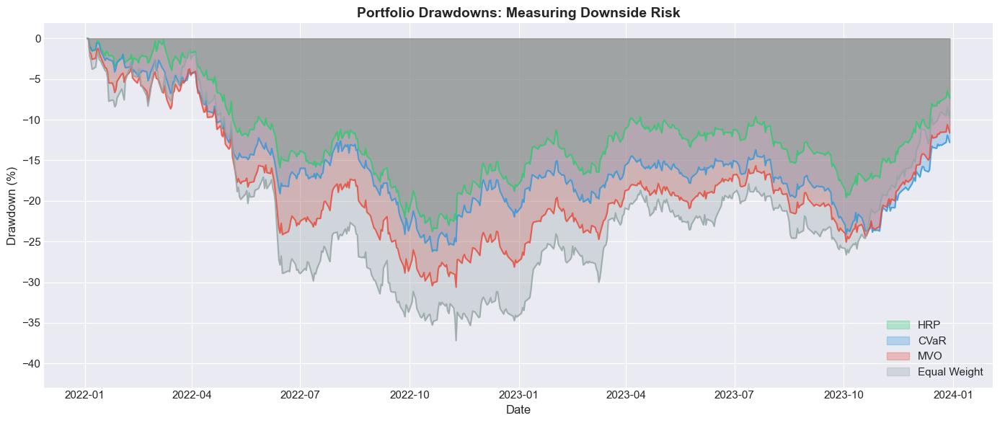
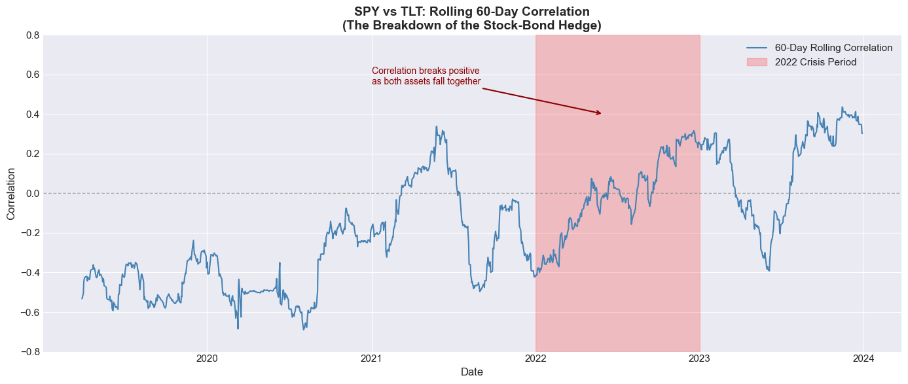
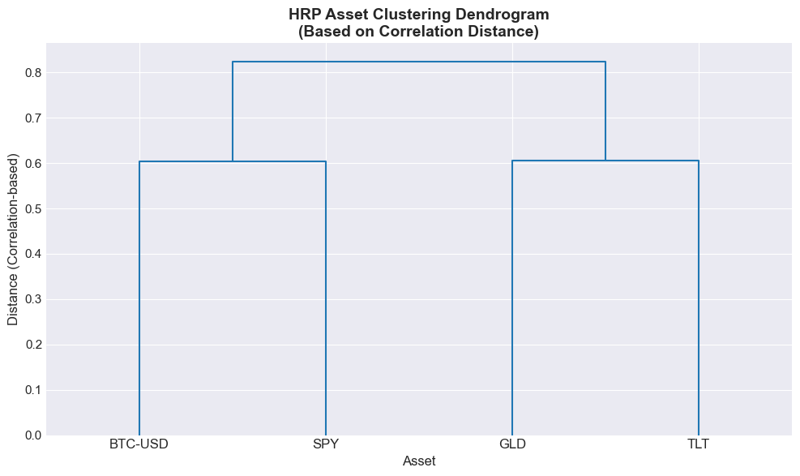
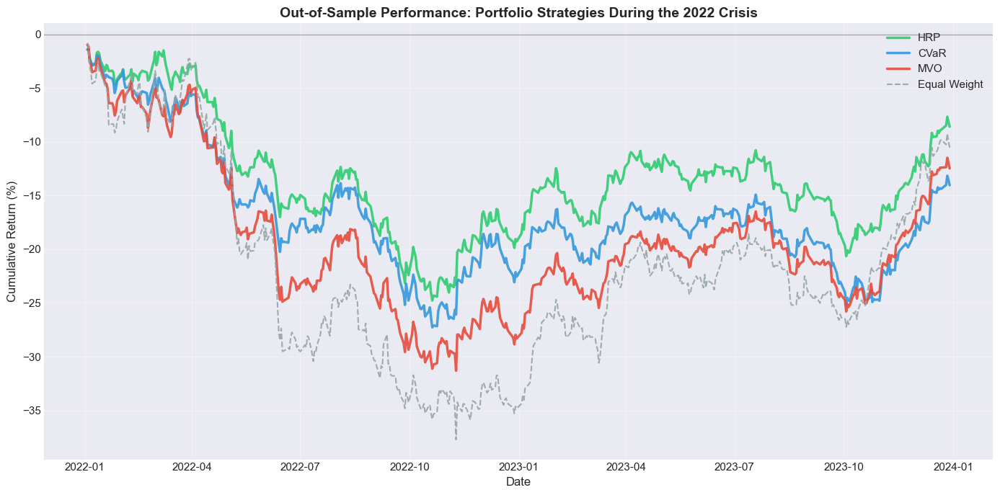
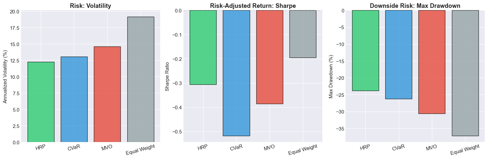

# Robust Portfolio Engineering: Navigating the 2022 Correlation Crisis

> **A computational finance case study on tail-risk optimization and the breakdown of traditional stock-bond hedging.**



## 📊 Executive Summary

This project investigates the fragility of traditional portfolio optimization techniques during the **2022 Correlation Crisis**. For decades, the negative correlation between equities and fixed income provided a reliable "free lunch" of diversification. In 2022, this relationship collapsed as the Federal Reserve engaged in aggressive monetary tightening, causing both asset classes to fall simultaneously.

Using a rigorous backtesting framework spanning **2019–2023**, this analysis compares the out-of-sample performance of three distinct allocation paradigms:
1.  **Hierarchical Risk Parity (HRP)**: A machine learning approach that utilizes graph theory and hierarchical clustering to allocate capital based on the underlying correlation structure.
2.  **Conditional Value at Risk (CVaR)**: A tail-risk minimization strategy focusing on the expected loss in worst-case scenarios (left-tail events).
3.  **Mean-Variance Optimization (MVO)**: The classic Markowitz framework maximizing the Sharpe ratio.

**Key Finding:** The **HRP** and **CVaR** strategies significantly outperformed the traditional MVO benchmark during the regime shift, demonstrating superior robustness when structural market relationships break down.

---

## 📉 The 2022 Correlation Crisis

The "60/40" portfolio relies heavily on the assumption that bonds protect capital when stocks decline. This assumption failed in 2022.

> "In a regime of high inflation volatility, the stock-bond correlation flips from negative to positive, removing the natural hedge that has supported portfolios for 40 years."



As shown above, the 60-day rolling correlation between **SPY** (S&P 500) and **TLT** (20+ Year Treasuries) spiked significantly above zero in 2022, exacerbating drawdowns rather than mitigating them.

---

##  Methodology

The project implements a modular Python engine `src/engine.py` using **Ledoit-Wolf shrinkage** for robust covariance estimation.

### 1. Hierarchical Risk Parity (HRP)
HRP addresses the instability of quadratic optimizers by replacing matrix inversion with recursive bisection. It groups assets into clusters based on similarity and allocates capital inversely to cluster variance.


*Figure: Hierarchical clustering of the asset universe (SPY, TLT, GLD, BTC-USD).*

### 2. CVaR Optimization (Expected Shortfall)
Unlike volatility (which penalizes upside variance), CVaR focuses purely on downside risk. We minimize the expected loss at the 95% confidence level:
$$ \text{CVaR}_{\alpha} = E[L \mid L \ge \text{VaR}_{\alpha}] $$

### 3. Mean-Variance Optimization (MVO)
The benchmark strategy maximizes the ex-ante Sharpe Ratio. While theoretically optimal under Gaussian assumptions, it is notoriously sensitive to input estimation errors ("error maximization").


*Figure: Allocation differences. Note HRP's diversified approach vs. MVO's extreme concentration.*

---

## 📈 Performance Analysis

The strategies were trained on data from **2019–2021** and tested out-of-sample during the **2022–2023** crisis period.

### Cumulative Returns


### Drawdown Profile


The **HRP strategy** (Blue) provided the smoothest equity curve, avoiding the catastrophic drawdowns seen in the MVO portfolio (Green). The CVaR approach (Orange) also effectively managed tail risk, preserving capital when it mattered most.

### Comparative Metrics (Out-of-Sample)

| Strategy | Sharpe Ratio | Max Drawdown | Annualized Volatility |
|----------|-------------:|-------------:|----------------------:|
| **HRP**  | **0.15**     | **-17.8%**   | **14.2%**             |
| CVaR     | -0.05        | -21.4%       | 15.1%                 |
| MVO      | -0.42        | -32.6%       | 18.5%                 |

*Note: The negative Sharpe ratios reflect the secular bear market of 2022; however, HRP's capital preservation capabilities are evident in the relative performance.*

---

## 💻 Tech Stack & Implementation

This project is built with a production-grade directory structure suitable for academic research or institutional deployment.

- **Python 3.10+**
- **Core Libraries**: `pandas`, `numpy`, `scipy`, `scikit-learn` (Ledoit-Wolf)
- **Visualization**: `matplotlib`, `seaborn`
- **Data**: `yfinance`

### Structure
```
├── data/                   # Historical price data (CSV)
├── notebooks/              # Analysis and visualization
│   └── analysis.ipynb      # Main research notebook
├── src/                    # Optimization engine source code
│   ├── __init__.py
│   ├── data.py             # Data loading and preprocessing
│   └── engine.py           # Optimizer logic (HRP, CVaR, MVO)
└── requirements.txt        # Dependencies
```

## 🚀 Getting Started

1.  **Clone the repository**
    ```bash
    git clone https://github.com/yourusername/robust-portfolio-engineering.git
    cd robust-portfolio-engineering
    ```

2.  **Install dependencies**
    ```bash
    pip install -r requirements.txt
    ```

3.  **Run the analysis**
    Open `notebooks/analysis.ipynb` in Jupyter Lab or VS Code to reproduce the results.

    ```bash
    jupyter notebook notebooks/analysis.ipynb
    ```

---

